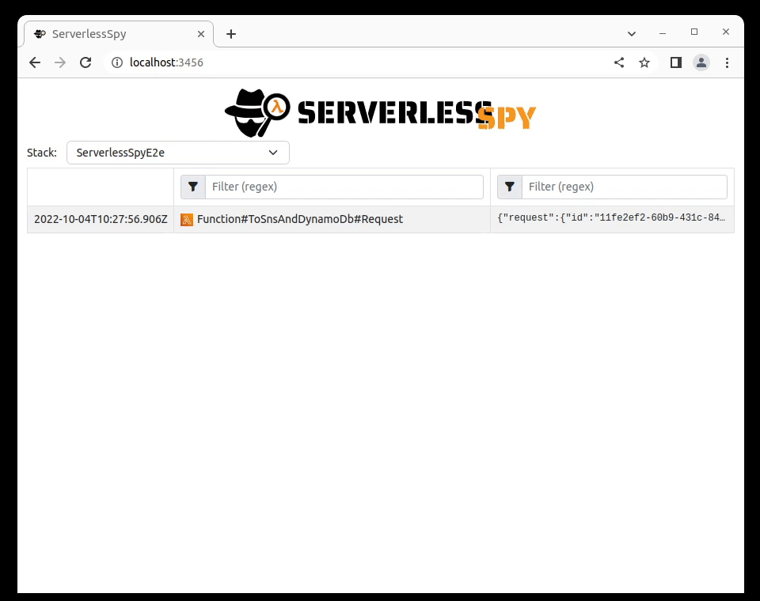

# Web console

The web console runs on your local computer and displays all events that ServerlessSpy intercepts in the environment. That is useful when developing to investigate what is happening in the system. The web console receives events via WebSocket and displays them in the table with a timestamp, event name, and data. You can filter events by event name and data. You can use regular expressions.

If events are hierarchical, like Lambda request & response, you can see an arrow from a parent to child event.



## Start
```bash
npx sspy --cdkoutput cdkOutput.json
```
The browser window will open [http://localhost:3456/](http://localhost:3456/).

`cdkOutput.json` contains exported CloudFormation outputs ([see](./quick_start.md)). The key output is `ServerlessSpyWsUrl`, which is the URL to the WebSocket where the testing library and web console receive events. You can also set websocket directly with parameter `--ws`.

## Parameters:
`--ws <ws>` - Websocket link (optional)

`--cdkoutput <cdkoutput>` - CDK output file that contains Websocket link in a property `ServerlessSpyWsUrl` (optional)

`--cdkstack <cdkstack>` - CDK stack in CDK output file. If not specified, the first one is picked (optional)

`--open <open>` - Open browser (optional, default: true)

`--port` - A port on localhost where ServerlessSpy web console is accessible (optional, default: "3456")  

